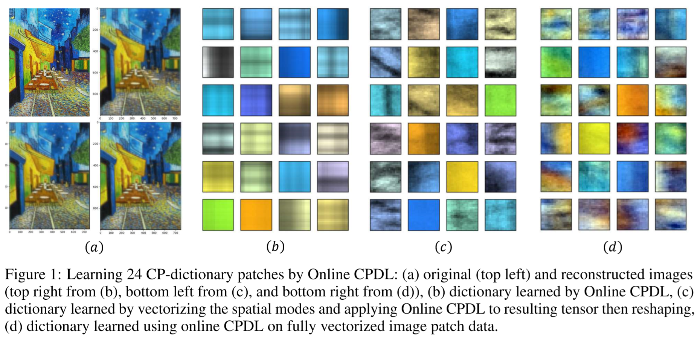
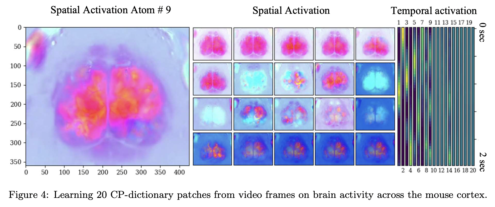
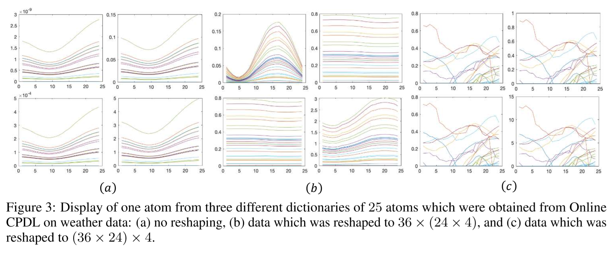

# Online CPDL

Online CP-Dictionary Learning Algorithm  \
Generalizes CP-decomposition for tensors, dictionary learning algorithm for vector-valued signals, and Online Nonnegative Matrix Factorization.

## References

These codes are based on my paper below: 
  1. Christopher Strohmeier, Hanbaek Lyu, and Deanna Needell, 
     “Online Dictionary Learning for Tensor Factorization” (submitted. Preprint available upon request.) 
     
     
## File description 

  1. **src/ocpdl.py** : main Online CPDL algorithm implementation 
  2. **src/BCD-DR.py** : implementation for Alternatiing Least Squares and Multiplicative Update for NCPD. Original repo: https://github.com/HanbaekLyu/BCD-DR
  3. **OCPDL_benchmark.py** : benchmark on NCPD against ALS and MU (generates benchmark figures in the paper)
  4. **image_reconstruction_OCPDL.py** : Applicatoin codes for CP-dictionary learning for color images 
  5. **video_reconstruction_OCPDL.py**: Applicatoin codes for CP-dictionary learning for color videos 
  6. **IMG_CP_reconstruction_main.py**: Main script for image application (example run on Van Gogh's "Cafe terrace at night")
  7. **VIDEO_CP_reconstruction_main.py**: Main script for video application (example run on mice brain activity video)
  
## Authors

* **Hanbaek Lyu** - *Initial work* - [Website](https://hanbaeklyu.com)
* **Christopher Strohmeier** - *Initial work* - [Website](https://github.com/tophythetoaster/T32)

## License

This project is licensed under the MIT License - see the [LICENSE.md](LICENSE.md) file for details
